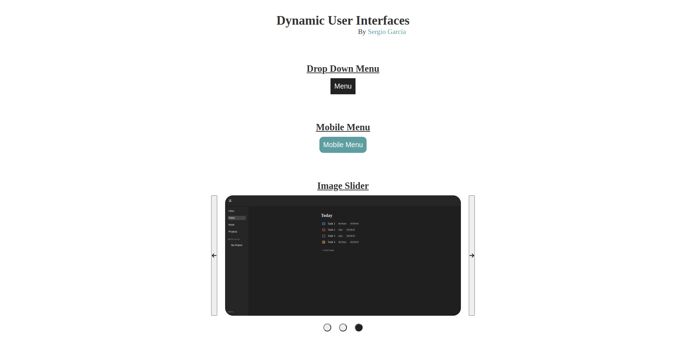

# Dynamic User Interfaces

Some dynamic user interfaces created with JavaScript.

The project is from [The Odin Project](https://www.theodinproject.com/lessons/node-path-javascript-dynamic-user-interface-interactions) curriculum.

## Screenshot

## Acknowledgements

- Project idea by [The Odin Project](https://www.theodinproject.com/)
- Web icon from [favicon](https://favicon.io/)

## Author

[Sergio García](https://github.com/sergiogarciiam)

## License

This project is open source and available under the [MIT License](./LICENSE).
